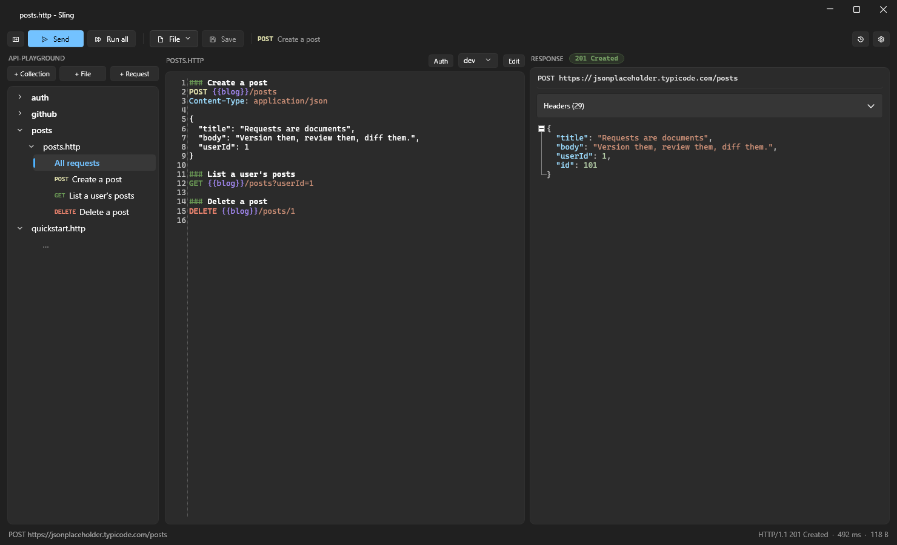
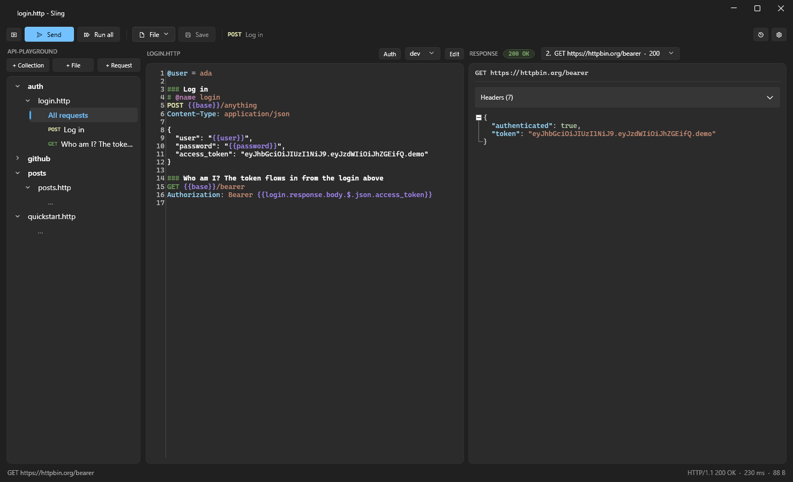
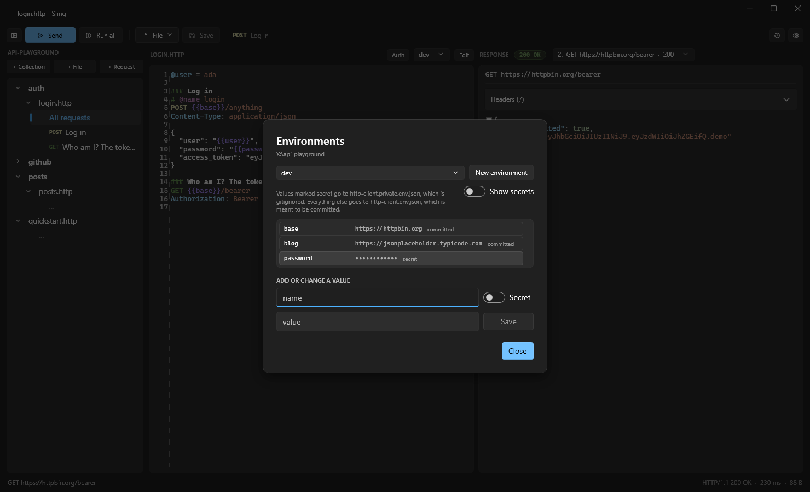
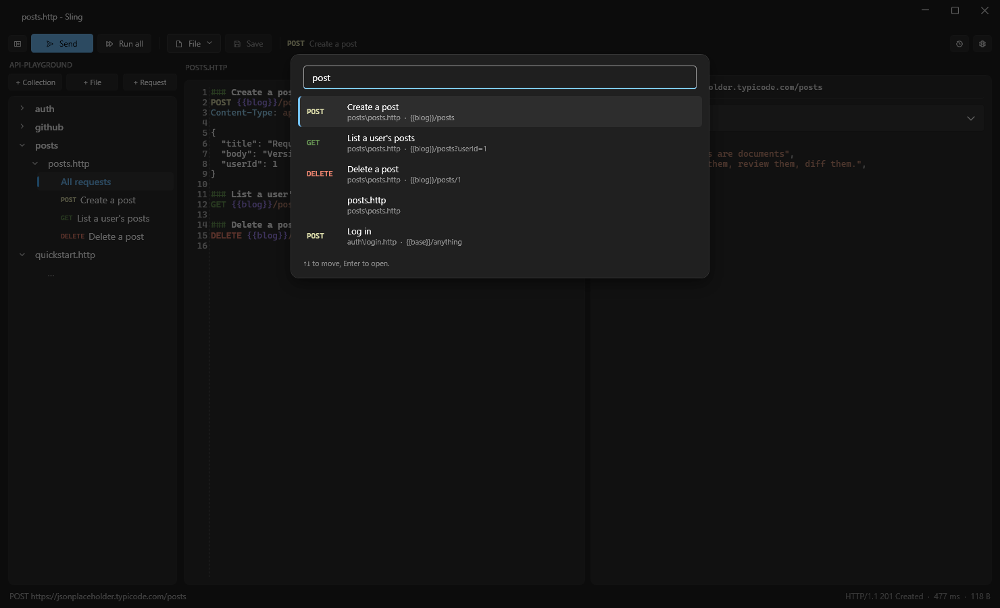
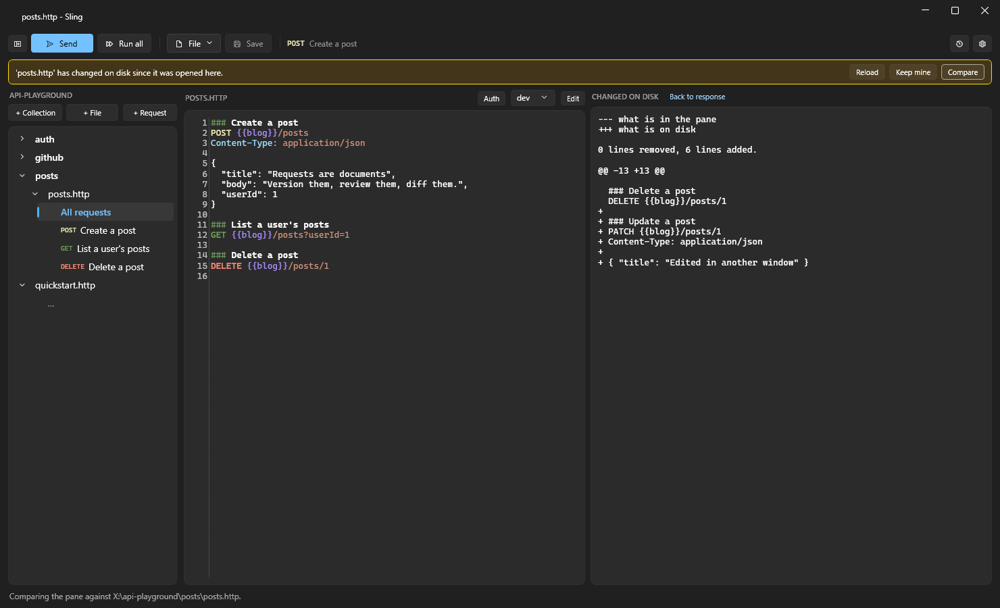

<p align="center">
  
</p>

<h1 align="center">Sling</h1>

<p align="center">
  <b>An HTTP client for Windows where the request is a text file, not a form.</b><br>
  Write requests in plain <code>.http</code> files, press <kbd>Ctrl</kbd>+<kbd>Enter</kbd>, and read the response in a real editor.
</p>

<p align="center">
  <a href="https://github.com/HendrikVrey/Sling/releases/latest/download/Sling-Setup.exe"><b>Download for Windows</b></a> ·
  <a href="#quick-start">Quick start</a> ·
  <a href="#features">Features</a> ·
  <a href="#keyboard-shortcuts">Shortcuts</a> ·
  <a href="#documentation">Docs</a> ·
  <a href="#faq">FAQ</a>
</p>

<p align="center">
  <a href="https://github.com/HendrikVrey/Sling/releases/latest"></a>
  
  
  
  
  
</p>

<p align="center">
  
</p>

---

## What is Sling?

Sling is a desktop app for calling HTTP APIs, like Postman or Insomnia, with one big
difference: **your requests are text files** in the standard
[`.http` format](https://learn.microsoft.com/aspnet/core/test/http-files) that Visual Studio,
JetBrains Rider and the VS Code REST Client already understand.

```http
@base = https://api.example.com

### Log in
# @name login
POST {{base}}/auth
Content-Type: application/json

{ "user": "ada", "password": "{{password}}" }

### Who am I? The token comes from the response above
GET {{base}}/me
Authorization: Bearer {{login.response.body.$.access_token}}
```

That file *is* the whole collection. Put it in your repository and your team gets:

- **Requests you can review.** A change to an API call shows up as a normal diff in a pull request.
- **Collections that are just folders.** Grouping is `###`, hierarchy is directories, sharing is `git push`.
- **No lock-in.** Uninstall Sling tomorrow and every request still opens in your IDE.
- **No account, no cloud, no sync, no telemetry.** Nothing leaves your machine except the requests you send.

## Quick start

1. **[Download `Sling-Setup.exe`](https://github.com/HendrikVrey/Sling/releases/latest/download/Sling-Setup.exe)**
   and run it. It installs for your user only, so there is no admin prompt.
2. **Open a folder** with <kbd>Ctrl</kbd>+<kbd>Shift</kbd>+<kbd>O</kbd>. Any folder works: an empty one, or a
   repository that already has `.http` files in it.
3. **Write a request**, or click **+ Request**:
   ```http
   GET https://api.github.com/repos/dotnet/runtime
   ```
4. **Press <kbd>Ctrl</kbd>+<kbd>Enter</kbd>** (or **Send**). The response opens on the right, formatted and
   highlighted.

Coming from Postman? Press <kbd>Ctrl</kbd>+<kbd>I</kbd> to [import a collection](docs/postman-import.md),
environments included. Got a curl command? [Paste it](docs/curl-import.md) into the request pane
and it becomes a request.

## Features

### Collections without a collection format

The rail on the left is your folder: collections are directories, files are `.http` documents,
and each `###` block inside a file is a request, with its verb colour-coded. Click a request to
show it on its own, or **All requests** to see the whole file. Sling stores nothing to draw the
tree, so renaming a collection is renaming a folder. [More about collections →](docs/collections.md)

### Chain requests together

Name a request with `# @name`, then pull any value out of its response with JSONPath:
`{{login.response.body.$.access_token}}`. Sending a request that depends on another sends the
dependency first, automatically. **Run all** (<kbd>Ctrl</kbd>+<kbd>Shift</kbd>+<kbd>Enter</kbd>) sends every
request in the file, and the picker beside the response lets you step through each exchange.

<p align="center">
  
</p>

### Environments and secrets, kept apart

Switch between `dev`, `staging` and `prod` from the picker above the request. Values live in
`http-client.env.json`, which you commit, and secrets live in `http-client.private.env.json`,
which Sling adds to your `.gitignore` for you. These are the same files Rider and Visual Studio
use, so existing environments work unchanged. Press <kbd>Ctrl</kbd>+<kbd>E</kbd> to edit them without
hand-writing JSON. [More about environments →](docs/environments.md)

<p align="center">
  
</p>

### Find anything with <kbd>Ctrl</kbd>+<kbd>P</kbd>

Quick open searches every request in the folder by collection, file name, request name, verb
and URL. Every word you type has to match somewhere, so `post orders` and `orders staging` both
find what you mean.

<p align="center">
  
</p>

### It notices when the file changes underneath you

A `.http` file lives in git, so a pull, a branch switch or another editor can change it while
it is open. Sling spots that the moment you come back and offers **Reload**, **Keep mine** or
**Compare**, and it will not save over a version you have not seen.

<p align="center">
  
</p>

### And the rest

| | |
|---|---|
| **A response you can work with** | The body lands in a real editor buffer: highlighted, foldable, searchable with <kbd>Ctrl</kbd>+<kbd>F</kbd>. Right-click to format JSON, decode base64 or a JWT, and chain transforms. |
| **Auth that is not a mystery** | <kbd>Ctrl</kbd>+<kbd>Alt</kbd>+<kbd>A</kbd> shows which credential a request sends and where it comes from. OAuth 2.0 client credentials and authorization code with PKCE are built in, and tokens refresh on a 401. [Auth docs →](docs/auth.md) |
| **Postman import** | Collections and environments come across in one step, and no credential is ever written into a `.http` file. [Import docs →](docs/postman-import.md) |
| **curl paste** | Paste a curl command and get a request. Anything that cannot be expressed becomes a comment saying what was dropped. [curl docs →](docs/curl-import.md) |
| **File and multipart bodies** | `< ./payload.json` sends a file; `<@ ./template.json` fills in `{{variables}}` first. |
| **Cookies** | A cookie jar per environment, so a staging cookie can never reach production. |
| **History** | <kbd>Ctrl</kbd>+<kbd>H</kbd> shows what you sent and what came back, with credentials redacted and no bodies stored. [History docs →](docs/history.md) |
| **Picks up where you left off** | The last folder, file, caret and pane sizes come back when you reopen Sling. |
| **Completion** | <kbd>Ctrl</kbd>+<kbd>Space</kbd> completes directives, headers and variables. |

## Keyboard shortcuts

Everything is also a button, and every button's tooltip names its shortcut.

| Shortcut | Action |
|---|---|
| <kbd>Ctrl</kbd>+<kbd>Enter</kbd> | Send the request under the caret |
| <kbd>Ctrl</kbd>+<kbd>Shift</kbd>+<kbd>Enter</kbd> | Send every request in the file |
| <kbd>Esc</kbd> | Cancel the run, or close a panel |
| <kbd>Ctrl</kbd>+<kbd>P</kbd> | Go to a file or a request |
| <kbd>Ctrl</kbd>+<kbd>O</kbd> / <kbd>Ctrl</kbd>+<kbd>Shift</kbd>+<kbd>O</kbd> | Open a file / a folder |
| <kbd>Ctrl</kbd>+<kbd>S</kbd> / <kbd>Ctrl</kbd>+<kbd>Shift</kbd>+<kbd>S</kbd> | Save / save as |
| <kbd>Ctrl</kbd>+<kbd>N</kbd> | New document |
| <kbd>Ctrl</kbd>+<kbd>Shift</kbd>+<kbd>N</kbd> | Add a request to the open file |
| <kbd>Ctrl</kbd>+<kbd>I</kbd> | Import a Postman export |
| <kbd>Ctrl</kbd>+<kbd>B</kbd> | Show or hide the collections rail |
| <kbd>Ctrl</kbd>+<kbd>F</kbd> | Find, in either pane |
| <kbd>Ctrl</kbd>+<kbd>Space</kbd> | Complete a directive, header or variable |
| <kbd>Ctrl</kbd>+<kbd>Alt</kbd>+<kbd>A</kbd> | Auth for this request |
| <kbd>Ctrl</kbd>+<kbd>E</kbd> | Environments and secrets |
| <kbd>Ctrl</kbd>+<kbd>H</kbd> | History |
| <kbd>Ctrl</kbd>+<kbd>,</kbd> | Settings |

## Sling or Postman?

Sling is for developers who already find Postman heavier than the job: the people with a
scratch collection called "test" who have thought about going back to curl.

| | Sling | Postman |
|---|---|---|
| A request is stored as | A few lines of text in a `.http` file | An entry in a large collection JSON export |
| Reviewing a change | A normal diff in a pull request | Hard to read in a diff |
| Opens in VS, Rider, VS Code | Yes, same format | No |
| Account or cloud needed | No | Built around a synced workspace |
| Scripting, test assertions, mock servers | No, deliberately | Yes |

If you live in Postman's Tests tab, collection runner or mock servers, Sling is not trying to
replace that. It covers what most people actually use an API client for, as files you own.

## Security

Sling handles credentials, so these are rules, not options:

- **Secrets live in a separate, gitignored file**, and imports never write a literal credential into a `.http` file.
- **`Authorization`, `Cookie` and `Proxy-Authorization` are dropped** when a redirect crosses origins.
- **TLS validation is on by default.**
- **Stored tokens are encrypted** with Windows data protection under your account, scoped per folder and environment. No client secret is written to disk.
- **History redacts credentials and stores no request or response bodies.**
- **Responses render as text**, never in a browser control.
- **No telemetry**, no update ping, no crash upload.

## Download

| | |
|---|---|
| **[Sling-Setup.exe](https://github.com/HendrikVrey/Sling/releases/latest/download/Sling-Setup.exe)** | The latest release. One installer for both x64 and arm64. |
| **[Sling-Setup.exe from `master`](https://github.com/HendrikVrey/Sling/releases/download/latest/Sling-Setup.exe)** | The newest build of `master`. It is only replaced when the test suite passes, so a broken commit never reaches it. |

The installer is per-user: no admin rights, no UAC prompt, nothing running at startup. It installs
to `%LOCALAPPDATA%\Programs\Sling` and adds Sling to **Open with** for `.http` and `.rest` files.
Making Sling the default for those files is an unticked option, because your IDE probably owns them
already.

Sling is not code-signed yet, so Windows SmartScreen will warn you the first time. If you would
rather not click through that, [build it yourself](#building-from-source).

## Documentation

| Guide | What it covers |
|---|---|
| [The `.http` dialect](docs/http-dialect.md) | Everything Sling reads, and where it differs from the VS Code REST Client |
| [Collections](docs/collections.md) | How the rail maps to folders and files |
| [Environments](docs/environments.md) | The two environment files, `$shared`, and precedence |
| [Auth](docs/auth.md) | Bearer, basic, OAuth 2.0, token storage and refresh |
| [Postman import](docs/postman-import.md) | What comes across, and what cannot |
| [curl import](docs/curl-import.md) | The paste rules and the flags it refuses |
| [History](docs/history.md) | What is recorded and what redaction catches |
| [Etch.Core package](docs/etch-core-package.md) | The one extra build step, and why |

## FAQ

**Will my requests work in other tools?**
Yes. `.http` is the format Visual Studio 2022, Rider and the VS Code REST Client read. Sling's
few extensions are listed in [the dialect guide](docs/http-dialect.md).

**Where are my requests stored?**
Wherever you put them. Sling opens a folder and reads the `.http` files in it. The only things
it keeps for itself (history, the last session, encrypted tokens) are in `%LOCALAPPDATA%\Sling`,
never in your repository.

**Does it run on macOS or Linux?**
No. Sling is a native Windows app built on WPF.

**Can I run scripts or write tests?**
No, by design. A scripting runtime is what turns a request file back into something only one
tool can run.

**Is it free?**
Yes, to download and use for anything, including at work. See [Licence](#licence).

## Building from source

You need the .NET 10 SDK and a checkout of [Etch](https://github.com/HendrikVrey/Etch) next to
this one, because Sling uses `Etch.Core` from a private package feed.
[Why, and how to authenticate instead →](docs/etch-core-package.md)

```bash
dotnet pack ../Etch/src/Etch.Core/Etch.Core.csproj -c Release -o local-feed
```

```bash
dotnet build Sling.slnx
```

```bash
dotnet test Sling.slnx
```

<details>
<summary><b>Building the installer</b></summary>

Needs [Inno Setup](https://jrsoftware.org/isinfo.php) on the `PATH`. Publish both architectures,
then pack:

```bash
dotnet publish src/Sling.App/Sling.App.csproj -c Release -r win-x64 --self-contained true -p:PublishSingleFile=true -p:PublishReadyToRun=true -p:Version=1.0.0 -o publish/win-x64
```

```bash
dotnet publish src/Sling.App/Sling.App.csproj -c Release -r win-arm64 --self-contained true -p:PublishSingleFile=true -p:PublishReadyToRun=true -p:Version=1.0.0 -o publish/win-arm64
```

```bash
iscc installer\Sling.iss /DAppVersion=1.0.0 /DNumericVersion=1.0.0
```

`Sling-Setup.exe` lands in `dist/`. [The release workflow](.github/workflows/release.yml) runs
exactly these commands.

</details>

<details>
<summary><b>Project layout</b></summary>

| Project | Contains |
|---|---|
| `Sling.Core` | The `.http` parser, models, variable and chain resolution, redaction. No I/O, no network. |
| `Sling.Import` | Postman v2.1 and curl to `.http`. |
| `Sling.Http` | The only project that touches the network. |
| `Sling.Persistence` | All disk I/O. |
| `Sling.App` | The WPF shell (WPF-UI and AvalonEdit). |

The boundaries are enforced by `ArchitectureTests`, not just documented.

</details>

## Licence

**Source-available, not open source.** Sling is free to download, read, build and run, for
anything, including commercially. You may not modify it, republish it or sell it. See
[LICENSE](LICENSE) for the terms, and [THIRD-PARTY-NOTICES.md](THIRD-PARTY-NOTICES.md) for the
components it is built on.

Your request files, and everything you send and receive with Sling, are yours.
